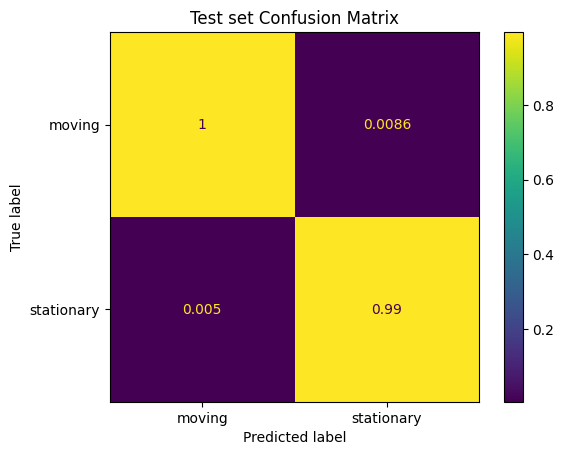
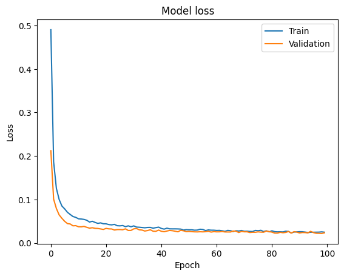

# RFID Tag Movement Detection

## Overview

The RFID Tag Movement Detection project aims to develop an artificial intelligence (AI) algorithm using machine learning and deep learning techniques to identify whether RFID tags are stationary or moving. This system has applications in various settings, such as retail stores and industrial environments, for detecting theft, tracking assets, and optimizing inventory management.

## Project Goals

The primary goal of this project is to build a machine learning model that can accurately classify RFID tags as stationary or moving based on Received Signal Strength Indication (RSSI) data obtained from RFID readers. Specifically, the project involves:

- Preprocessing the RFID tag data to handle missing values and prepare it for model training.
- Exploring various machine learning and deep learning models, including Support Vector Machines (SVM), Long Short-Term Memory (LSTM) networks, and Random Forests, to determine the most effective approach.
- Training and evaluating the selected models using the prepared dataset.
- Developing a scalable and adaptable system that can be deployed in real-world environments.

## Dataset

The dataset consists of data collected from an experiment involving 200 RFID tags, with 100 stationary and 100 moving. Antennas were strategically placed to simulate real-world scenarios, and data on RSSI measurements were collected over time.

	
	
Experiment used to collect the data

## Preprocessing Steps

⚠️ The dataset processing scripts are not in this repo. The processed datasets are in the `data/` folder.

The preprocessing steps for the RFID tag data include:

- Handling missing values: Due to the nature of RFID detection, missing values (NaN) are present in the dataset. Techniques such as moving average and Kalman filter are explored to impute missing data.
- Splitting the dataset: The dataset is divided into training and testing sets to train and evaluate the machine learning models.

## Models Used

The project explores multiple machine learning and deep learning models.

Each model is evaluated based on its performance in classifying RFID tags as stationary or moving.

### Random Forest

	

		
		
Training set Confusion Matrix

	

	

		
		
Test set Confusion Matrix

	

	
	
ROC curve

**No overfitting**, test set macro accuracy: **99%**.

### Neural Network

Trained for 100 epochs.

	
	
Test set Confusion Matrix

	
	
Accuracy over 100 epochs

	
	
Loss over 100 epochs

Great accuracy of **98.98%**, no overfitting.

## Repository Structure

The repository structure is as follows:

- `data/`: Contains the raw dataset and every processed data files.
- `docs/`: Visualizations of the project setting. 
- `results/`: Contains visualizations and evaluation metrics generated during the project.
- `classic_ML.ipynb`: Notebook used to train and test the SVM and the Random Forest.
- `neural_network.ipynb`: Notebook used to train and test the Neural Network.
- `data_visualization.ipynb`: Notebook used to perform and plot some data analysis.
- `README.md`: Provides an overview of the project and instructions for running the code.
- `requirements.txt`: Lists the required Python libraries and dependencies.

## Future Work

Future work for the project includes:

- Refining and optimizing the selected machine learning models.
- Investigating additional preprocessing techniques to improve model performance.
- Scaling the system to handle larger datasets and real-time RFID data streams.
